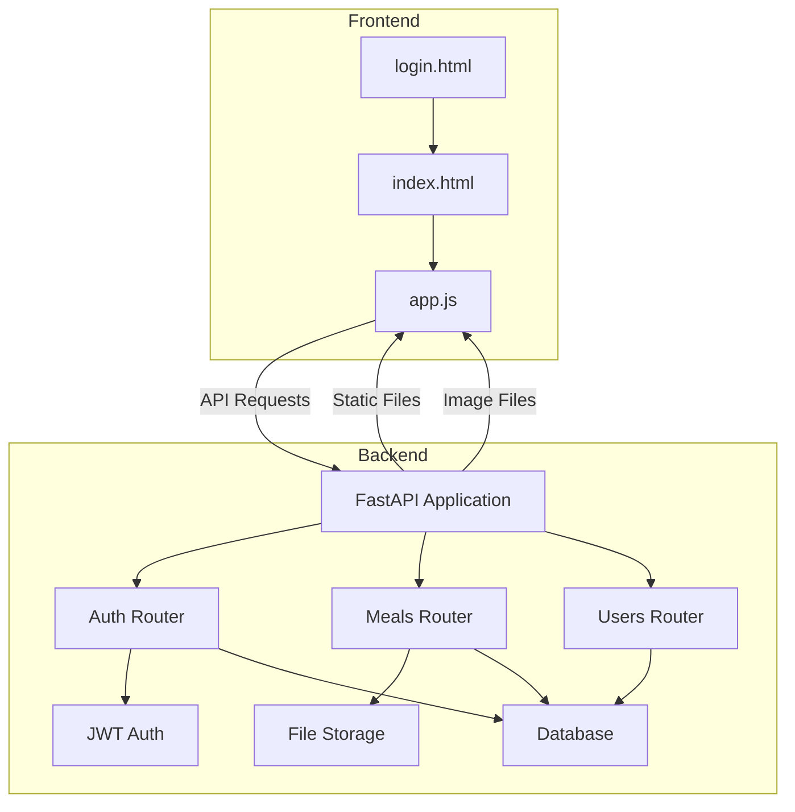
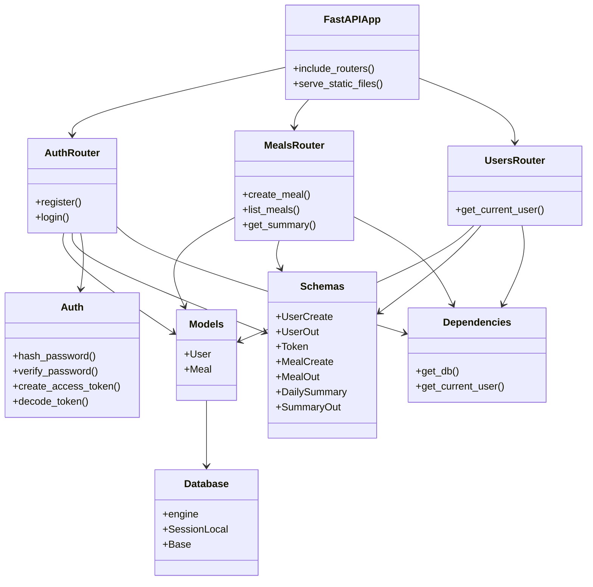
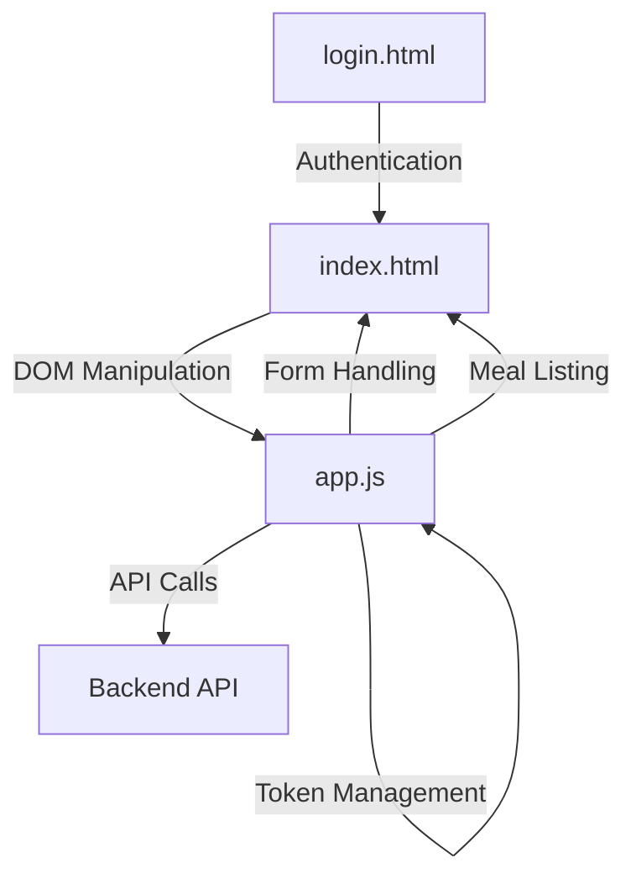
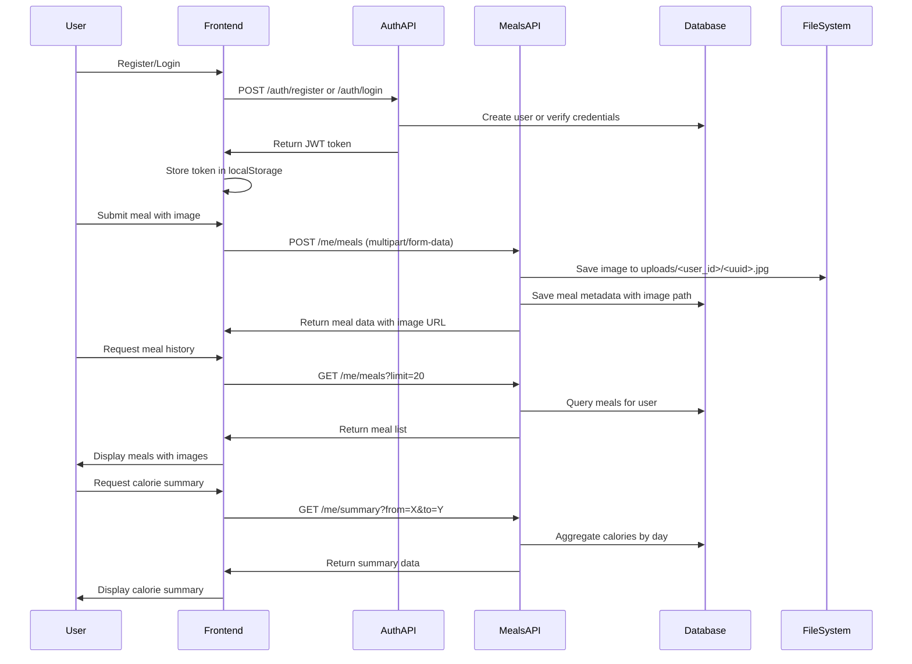

# Calorie Tracking Application: Implementation Plan

## 1. System Overview

The application is a calorie tracking system that allows users to:
- Register and authenticate
- Upload food images with associated metadata (calories, meal type, etc.)
- View their meal history
- Get calorie summaries by day/period

### Architecture Diagram



## 2. Key Components and Their Relationships

### 2.1 Backend Components



### 2.2 Frontend Components



### 2.3 Data Flow



## 3. Project Structure and File Organization

The project follows a clean, modular structure:

```
calorie-tracker/
├─ backend/
│  ├─ app/
│  │  ├─ main.py                # FastAPI application entry point
│  │  ├─ settings.py            # Configuration settings
│  │  ├─ database.py            # Database connection
│  │  ├─ models.py              # SQLAlchemy ORM models
│  │  ├─ schemas.py             # Pydantic schemas for validation
│  │  ├─ auth.py                # Authentication utilities
│  │  ├─ crud.py                # Database operations
│  │  ├─ deps.py                # Dependency injection
│  │  └─ routers/               # API route modules
│  │     ├─ auth_router.py      # Authentication endpoints
│  │     ├─ meals_router.py     # Meal management endpoints
│  │     └─ users_router.py     # User management endpoints
│  ├─ uploads/                  # User uploaded images (generated at runtime)
│  └─ static/                   # Static assets (optional)
├─ frontend/
│  ├─ index.html                # Main application page
│  ├─ login.html                # Authentication page
│  └─ app.js                    # Frontend JavaScript
└─ pyproject.toml / requirements.txt  # Dependencies
```

## 4. Implementation Plan

### Phase 1: Setup and Configuration (1-2 days)
1. Create project structure
2. Set up virtual environment
3. Install dependencies
4. Configure database connection
5. Set up JWT authentication

### Phase 2: Backend Development (3-5 days)
1. Implement database models
2. Create Pydantic schemas
3. Implement authentication system
4. Develop user management endpoints
5. Implement meal management endpoints
6. Create summary/reporting functionality
7. Set up file storage for images

### Phase 3: Frontend Development (2-3 days)
1. Create login page
2. Implement authentication flow
3. Develop main application page
4. Implement meal submission form
5. Create meal listing functionality
6. Add summary visualization

### Phase 4: Integration and Testing (2-3 days)
1. Connect frontend to backend
2. Test authentication flow
3. Test meal creation and listing
4. Test summary functionality
5. Perform security testing
6. Optimize performance

### Phase 5: Deployment and Documentation (1-2 days)
1. Prepare deployment configuration
2. Document API endpoints
3. Create user documentation
4. Deploy application

## 5. Potential Challenges and Considerations

### 5.1 Technical Challenges

1. **Image Handling**:
   - Ensuring secure file uploads
   - Validating file types and sizes
   - Efficient storage and retrieval
   - Potential solution: Implement strict validation, use UUID filenames, consider image compression

2. **Authentication Security**:
   - JWT token management
   - Password security
   - Potential solution: Proper token expiration, secure password hashing, HTTPS in production

3. **Data Validation**:
   - Ensuring proper input validation
   - Handling edge cases
   - Potential solution: Leverage Pydantic for strict validation, implement comprehensive error handling

4. **Performance**:
   - Database query optimization
   - Image loading efficiency
   - Potential solution: Implement pagination, create database indexes, consider image thumbnails

### 5.2 Scalability Considerations

1. **Database Growth**:
   - Plan for migration from SQLite to PostgreSQL
   - Consider database partitioning for large datasets
   - Implement efficient queries for summary calculations

2. **File Storage**:
   - Local storage limitations
   - Migration path to cloud storage (S3/Blob)
   - Implement presigned URLs for secure access

3. **User Growth**:
   - Authentication system scalability
   - API rate limiting
   - Caching strategies

### 5.3 Security Considerations

1. **File Upload Security**:
   - Implement file size limits
   - Validate MIME types
   - Consider virus scanning for production

2. **Authentication Enhancements**:
   - Add refresh token mechanism
   - Implement token revocation
   - Consider adding 2FA for higher security

3. **Data Protection**:
   - Ensure proper user data isolation
   - Implement proper access controls
   - Consider data encryption for sensitive information

### 5.4 Future Enhancements

1. **Feature Expansion**:
   - Social sharing capabilities
   - Nutritional information extraction from images
   - Meal recommendations
   - Goal setting and tracking

2. **Technical Improvements**:
   - Implement WebSockets for real-time updates
   - Add offline support with service workers
   - Implement progressive image loading

3. **User Experience**:
   - Add mobile-responsive design
   - Implement dark mode
   - Add data visualization for trends

## 6. Implementation Recommendations

1. **Start Simple**: Begin with core functionality and expand incrementally
2. **Test Early**: Implement testing from the beginning
3. **Security First**: Prioritize security considerations throughout development
4. **Document As You Go**: Maintain documentation alongside code development
5. **Consider Monitoring**: Plan for logging and monitoring in production

## 7. API Endpoints

### Authentication Endpoints
- `POST /auth/register` - Register a new user
- `POST /auth/login` - Authenticate and receive JWT token

### User Endpoints
- `GET /users/me` - Get current user information

### Meal Endpoints
- `POST /me/meals` - Create a new meal with image
- `GET /me/meals` - List user's meals with filtering options
- `GET /me/summary` - Get calorie summary for a specified period

## 8. Data Models

### User Model
- id: Integer (Primary Key)
- email: String (Unique)
- name: String
- password_hash: String
- created_at: DateTime

### Meal Model
- id: Integer (Primary Key)
- user_id: Integer (Foreign Key)
- image_path: String
- calories: Integer
- meal_type: String (breakfast|lunch|dinner|snack)
- consumed_at: DateTime
- notes: String (Optional)
- created_at: DateTime

## 9. Technology Stack

### Backend
- FastAPI - Web framework
- SQLAlchemy - ORM
- Pydantic - Data validation
- JWT - Authentication
- SQLite/PostgreSQL - Database
- Python 3.8+ - Programming language

### Frontend
- HTML5 - Structure
- JavaScript (ES6+) - Logic
- CSS3 - Styling (minimal)
- Fetch API - HTTP requests

### Development Tools
- Virtual Environment - Dependency isolation
- Git - Version control
- Uvicorn - ASGI server

## 10. Deployment Considerations

### Development Environment
- Local development with Uvicorn
- SQLite database for simplicity
- Direct file access for uploads

### Production Environment
- HTTPS with proper certificates
- PostgreSQL database
- Potential cloud storage for images
- Proper CORS configuration
- Rate limiting
- Monitoring and logging